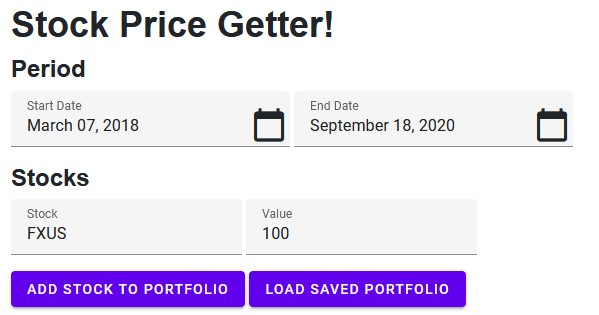
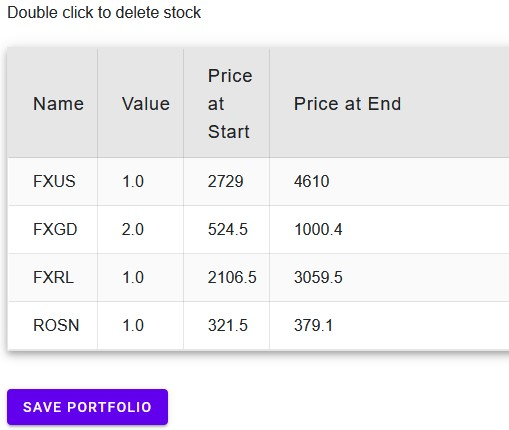
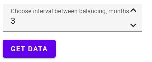
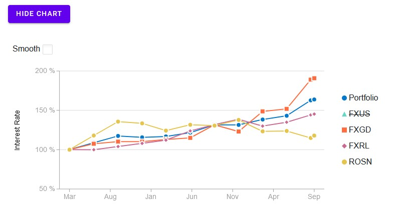

# About
It is my study-project to learn C# and a bit of Web-Dev. It's deployed and functioning at [GitHub pages](https://mjh-sakh.github.io/MOEX-Web/). 

My goal was to test out following Software Development things:
- [x] наследование классов 
- [ ] интерфейсы
- [x] extension классы 
- [ ] generics
- [ ] документация 
- [x] overloads
- [x] unit tests
- [x] asynchronous tasks, parallel runs 
- [x] working with browser local storage

# Service 
Service allows to build portfolio of stocks and requests data from MOEX to analyze how value of it changed in requested period. 
Balancing interval may be provided. In this case original proportion between stocks will be restored at the end of each interval. 

# Use
First, one need to select dates of period and add stocks one by one to portfolio with given value. There is an option to load previously saved portfolio (it's saved to browser storage, so each browser will have their own and information is not passed between them).

Composition of portfolio will be shown in the table. Double-click on line will delete it. There is an option to save it. 

Select balancing interval in months for portfolio and hit 'get data'.

Results are presented in concise manner: 

There is an option to show classic charts where interest rate is shown for entire portfolio and individual stocks. 

# Plans
Above is just a foundation to get data from MOEX. Next intentions are:
- [x] balancing with given frequency and fee
- [ ] ~~balancing with given fee~~
- [ ] ~~running and comparing multiple portfolio~~
- [x] web interface 
- [x] classic graphs (starting at 100% and then ups and downs)
- [x] saving and loading a portfolio
- [ ] ~~save several portfolios and load selected~~
- [x] move to client side app (wasp)

## minor features
- [x] work day check or bypass so no empty data received from MOEX
- [x] change default dates to last work day and one year prior 
