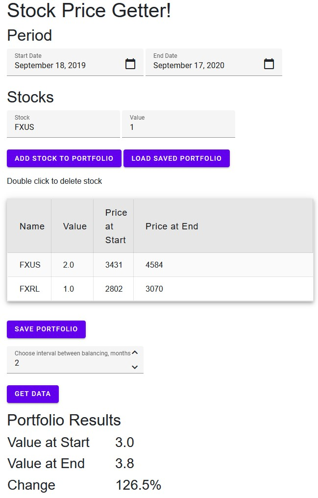

# About
Simple script to request data from MOEX to analyze how given portfolio changed in requested period. 
Balancing interval may be provided. In this case original proportion between stocks will be restored at the end of each interval. 

# Use
Add each stock to the table, then hit 'get data' and output is provided in very short format: 
- initial value
- final value
- change in % 

# Plans
Above is just a foundation to get data from MOEX. Next intentions are:
- [x] balancing with given frequency and fee
- [ ] balancing with given fee
- [ ] running and comparing multiple portfolio
- [x] web interface 
- [ ] classic graphs (starting at 100% and then ups and downs)
- [x] saving and loading a portfolio
- [ ] save several portfolios and load selected 
- [ ] move to client side app (wasp)

## minor features
- [x] work day check or bypass so no empty data received from MOEX
- [x] change default dates to last work day and one year prior 
